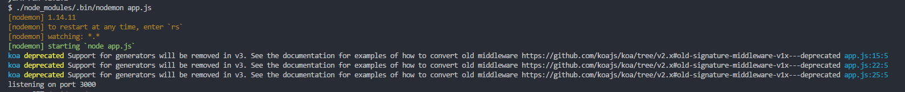
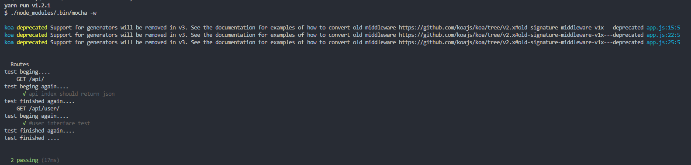
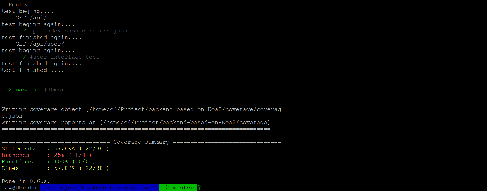

# koa2后台设计

## 安装

```shell
yarn install
```

## 启动

```shell
yarn run start
```

## 使用

```shell
curl http://localhost:30000/api/user/
```



## 测试

```shell
yarn run test
```



## 覆盖率测试

> 此覆盖率测试不能在Windows平台下运行

```shell
yarn run cover
```

